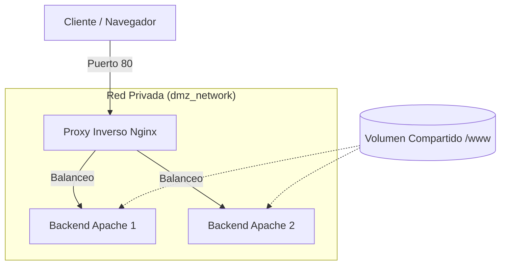
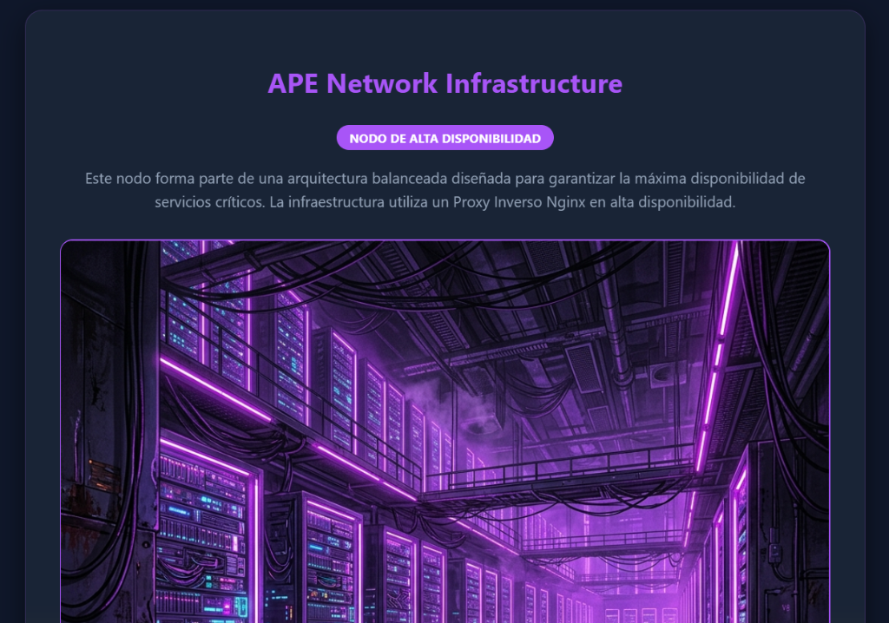
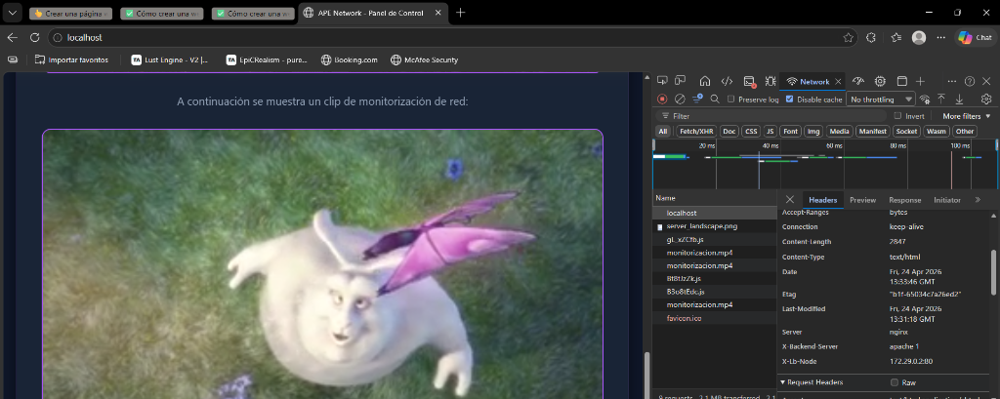
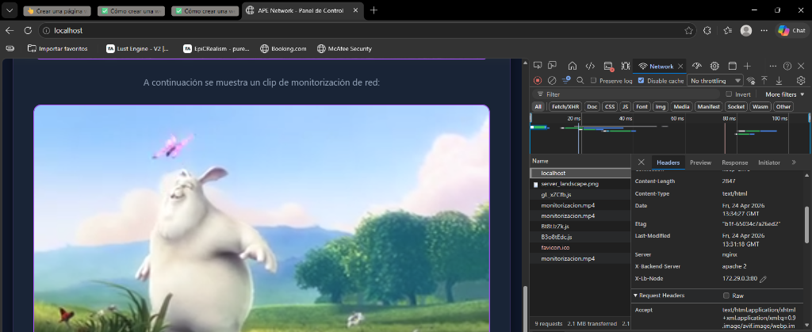
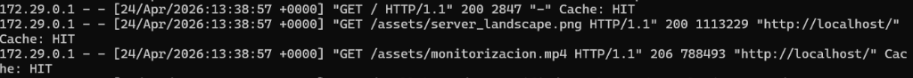

# 🛡️ Proyecto: Infraestructura Web Balanceada (APE)

## 📋 Descripción del Proyecto
Este proyecto consiste en el despliegue de una arquitectura de red de alta disponibilidad utilizando **Docker**. Se implementa un **Proxy Inverso** con Nginx que actúa como balanceador de carga para dos servidores de backend Apache, garantizando la escalabilidad y la seguridad mediante el aislamiento de red.

---

## 🏗️ Esquema de la Arquitectura
La infraestructura se organiza de la siguiente manera:



---

## 💡 Decisiones de Diseño

### 1. Elección de Imágenes Oficiales
- **Nginx (Alpine)**: Se ha elegido la versión Alpine por su ligereza y mínima superficie de ataque, ideal para un punto de entrada frontal.
- **Apache (httpd:alpine)**: Utilizado por su robustez en el manejo de cabeceras y compatibilidad con el módulo `mod_headers` para la identificación de nodos.

### 2. Estructura y Aislamiento de Red
- Se ha definido una red bridge personalizada (`dmz_network`). 
- **Aislamiento**: Los contenedores Apache **no exponen puertos al Host**. Solo el Proxy Nginx tiene visibilidad externa, forzando que todo tráfico pase por el filtro de seguridad y balanceo.

### 3. Persistencia y Volumen Compartido
- Se utiliza un volumen de host montado en `./www`. Esto garantiza que ambos backends sirvan exactamente el mismo contenido, simplificando la actualización de la web: cambiar un archivo en el host actualiza ambos servidores al instante.

### 4. Transparencia y Auditoría
- Se han inyectado cabeceras HTTP personalizadas (`X-Backend-Server`) para que el evaluador pueda verificar qué nodo está respondiendo en cada momento sin necesidad de entrar a los contenedores.

---

## 🚀 Despliegue y Verificación

### Comandos de Inicio
```bash
# Levantar el entorno en segundo plano
docker-compose up -d

# Verificar el estado de los contenedores
docker ps
```

### Comandos de Verificación (Examen)
1. **Verificación de Red (Aislamiento)**:
   Intentar acceder a los Apache desde el host (fallará ya que no exponen puertos):
   `curl localhost:80` (Éxito vía Proxy)
   `curl localhost:81` (Error - Puerto no mapeado)

2. **Verificación de Balanceo**:
   Ejecutar repetidamente para ver el cambio de IP en la cabecera `X-LB-Node`:
   `curl -I http://localhost`

---

## 📸 Evidencias de Funcionamiento

### 1. Interfaz del Panel de Control (Punto de Entrada)



### 2. Auditoría de Balanceo de Carga
Para garantizar la transparencia, el sistema firma cada respuesta con la identidad del servidor que la procesó:

| Nodo Apache 1 | Nodo Apache 2 |
| :---: | :---: |
|  |  |

### 3. Verificación de Optimización (Cache HIT)
La siguiente captura de los logs del contenedor `ape_nginx` demuestra que el motor de caché está funcionando correctamente, sirviendo peticiones repetidas con estado **HIT**:



---

**APE Systems - Architecture Exam 2026**
